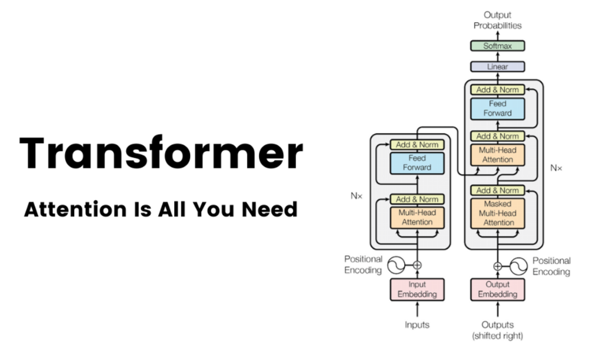
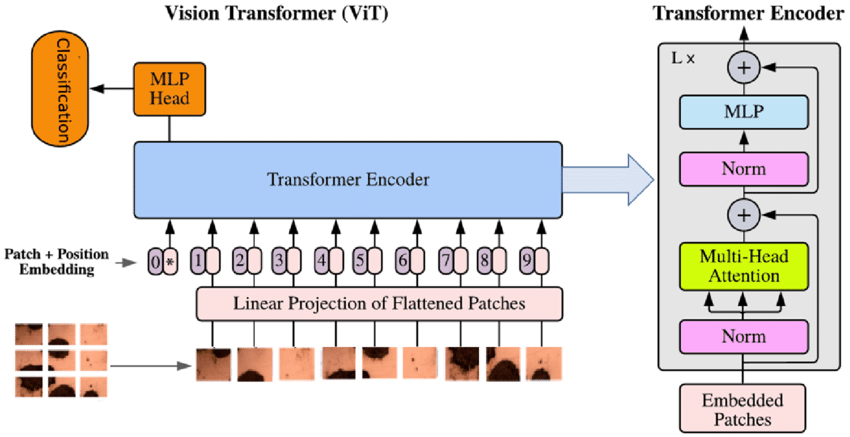

---
sidebar_position: 1
--- 
# Transformers: A Comprehensive Overview

## 1. What are Transformers?

Transformers are a type of deep learning model architecture that has revolutionized the field of natural language processing (NLP) and beyond. At their core, Transformers are designed to handle sequential data, such as text, by processing the entire input simultaneously rather than sequentially. This parallel processing is made possible through a mechanism called "self-attention," which allows the model to weigh the importance of different parts of the input when producing an output.

Key features of Transformers include:

1. **Self-Attention Mechanism**: Allows the model to focus on different parts of the input sequence when producing each part of the output.
2. **Positional Encoding**: Enables the model to understand the order of elements in the input sequence.
3. **Parallel Processing**: Allows for efficient training and inference on modern hardware.
4. **Scalability**: Can handle both short and long-range dependencies in data effectively.

## 2. Why Transformers Came into Picture

Before Transformers, the dominant architectures for handling sequential data were Recurrent Neural Networks (RNNs), particularly Long Short-Term Memory (LSTM) networks. However, these models had several limitations:

1. **Sequential Processing**: RNNs process data sequentially, making them slow to train on long sequences.
2. **Vanishing/Exploding Gradients**: Long sequences often led to issues with gradient flow during training.
3. **Limited Context**: While LSTMs improved on this, they still struggled with very long-range dependencies.
4. **Difficulty in Parallelization**: The sequential nature of RNNs made them challenging to parallelize on modern GPU hardware.

Transformers were developed to address these limitations, offering a more efficient and effective way to process sequential data.

## 3. History of Transformers

1. **Attention Mechanisms (2014-2015)**:
   - Bahdanau et al. introduced attention mechanisms in the context of neural machine translation.
   - This allowed models to focus on relevant parts of the input when generating each part of the output.

   

2. **Transformer Architecture (2017)**:
   - Vaswani et al. published "Attention Is All You Need," introducing the Transformer architecture.
   - Key innovations included multi-head attention and positional encoding.
   - The model achieved state-of-the-art performance on machine translation tasks.
   

3. **Pre-trained Language Models (2018-present)**:
   - BERT (Bidirectional Encoder Representations from Transformers) by Google (2018) demonstrated the power of pre-training on large text corpora.
   - GPT (Generative Pre-trained Transformer) series by OpenAI showed the potential of large-scale language models for various tasks.
   - Subsequent models like T5, RoBERTa, and XLNet further refined and expanded on these concepts.
   

5. **Transformers Beyond NLP (2020-present)**:
   - Vision Transformer (ViT) applied Transformer architecture to image classification.
   - Transformers have been adapted for multimodal tasks, combining text, image, and even audio processing.
   