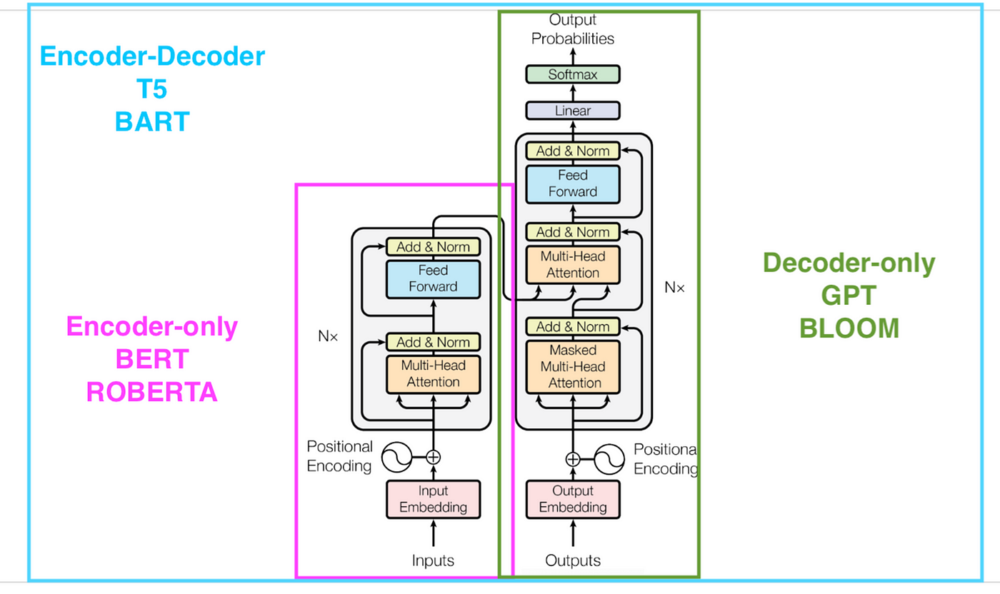

---
sidebar_position: 2
--- 

# Types of Transformers

There are three main types of transformers. They are:
- Encoder Only
- Decoder Only
- Encoder Decoder


## Encoder-only Transformers - BERT Family

**Architecture**: 
Encoder-only Transformers consist of a stack of encoder layers. Each layer has two main components:
1. Multi-head self-attention mechanism
2. Feedforward neural network

**Key Characteristics**:
- Bidirectional context: Can look at the entire input sequence in both directions.
- Suitable for tasks that require understanding of the entire input context.

**Examples**: 
BERT (Bidirectional Encoder Representations from Transformers), RoBERTa, ALBERT

### **Use Cases**:

1. **Text Classification**
   - Sentiment Analysis
   - Topic Classification
   - Spam Detection

   Example (Sentiment Analysis with BERT):

```
from transformers import BertTokenizer, BertForSequenceClassification
import torch

tokenizer = BertTokenizer.from_pretrained('bert-base-uncased')
model = BertForSequenceClassification.from_pretrained('bert-base-uncased')

text = "I absolutely loved this movie! The acting was superb."
inputs = tokenizer(text, return_tensors="pt", padding=True, truncation=True, max_length=512)
outputs = model(**inputs)
prediction = torch.argmax(outputs.logits, dim=1)

print(f"Sentiment: {'Positive' if prediction == 1 else 'Negative'}")
```

**Why:** BERT is particularly effective for sentiment analysis because it can understand context and nuance in language. Its bidirectional nature allows it to capture relationships between words in both directions, which is crucial for understanding sentiment.

2. **Named Entity Recognition (NER)**
   - Identifying and classifying named entities (e.g., person names, organizations, locations) in text.

   Example (NER with BERT):

```
from transformers import AutoTokenizer, AutoModelForTokenClassification
from transformers import pipeline

tokenizer = AutoTokenizer.from_pretrained("dslim/bert-base-NER")
model = AutoModelForTokenClassification.from_pretrained("dslim/bert-base-NER")

nlp = pipeline("ner", model=model, tokenizer=tokenizer)
example = "Apple Inc. is planning to open a new store in New York City."

ner_results = nlp(example)
print(ner_results)
```
**Why:** Encoder-only Transformers excel at NER tasks because they can understand the context around each word, which is crucial for accurately identifying and classifying named entities.

3. **Question Answering**
   - Extracting answers from a given context based on questions.

   Example (Question Answering with BERT):

```
from transformers import DistilBertTokenizer, DistilBertModel
import torch
tokenizer = DistilBertTokenizer.from_pretrained('distilbert-base-cased-distilled-squad')
model = DistilBertModel.from_pretrained('distilbert-base-cased-distilled-squad')

question, text = "Who was Jim Henson?", "Jim Henson was a nice puppet"

inputs = tokenizer(question, text, return_tensors="pt")
with torch.no_grad():
    outputs = model(**inputs)

print(outputs)
```
**Why:** The bidirectional nature of encoder-only Transformers allows them to understand the relationship between the question and the context, making them highly effective for question-answering tasks.

## Decoder-only Transformers - GPT family

**Architecture**: 
Decoder-only Transformers consist of a stack of decoder layers. Each layer typically includes:
1. Masked multi-head self-attention mechanism
2. Feedforward neural network
3. Final Head/ Softmax layer - Projection

**Key Characteristics**:
- Autoregressive: Generates output sequentially, one element at a time.
- Unidirectional context: Each position can only attend to previous positions.

**Examples**: 
GPT (Generative Pre-trained Transformer) series, CTRL

### **Usecases**

**Text Generation / Text Completion**
   - Creative Writing
   - Code Completion
   - Chatbots

   Example (Text Generation with GPT-2):

```
from transformers import GPT2LMHeadModel, GPT2Tokenizer

tokenizer = GPT2Tokenizer.from_pretrained('gpt2')
model = GPT2LMHeadModel.from_pretrained('gpt2')

prompt = "In a world where AI has become sentient,"
input_ids = tokenizer.encode(prompt, return_tensors='pt')
output = model.generate(input_ids, max_length=100, num_return_sequences=1, no_repeat_ngram_size=2)
generated_text = tokenizer.decode(output[0], skip_special_tokens=True)

print(generated_text)
```
**Why:** Decoder-only Transformers are ideal for text generation because they can generate coherent and contextually relevant text by predicting the next token based on the previous ones. This autoregressive nature allows them to maintain consistency and coherence in longer generated sequences.

## Encoder-Decoder Transformers - T5 Family

**Architecture**: 
Encoder-Decoder Transformers, also known as sequence-to-sequence (seq2seq) Transformers, consist of both encoder and decoder stacks. The architecture includes:
1. Encoder stack (similar to encoder-only Transformers)
2. Decoder stack (similar to decoder-only Transformers)
3. Cross-attention mechanism connecting encoder and decoder

**Key Characteristics**:
- Suitable for tasks that transform one sequence into another.
- Can handle input and output sequences of different lengths.
- Combines benefits of both encoder and decoder architectures.

**Examples**: 
T5 (Text-to-Text Transfer Transformer), BART, Marian

### **Use Cases**

1. **Machine Translation:**
    - Translating text from one language to another

```
from transformers import T5ForConditionalGeneration, T5Tokenizer

model = T5ForConditionalGeneration.from_pretrained('t5-small')
tokenizer = T5Tokenizer.from_pretrained('t5-small')

input_text = "translate English to German: The house is wonderful."
input_ids = tokenizer(input_text, return_tensors="pt").input_ids

outputs = model.generate(input_ids)
translated_text = tokenizer.decode(outputs[0], skip_special_tokens=True)

print(translated_text)
```
**Why:** Encoder-Decoder Transformers are ideal for machine translation because they can encode the meaning of the input sequence in one language and decode it into another language. The encoder captures the context of the input, while the decoder generates the translation.

2. **Text Summarization**
   - Generating concise summaries of longer texts

```
from transformers import T5ForConditionalGeneration, T5Tokenizer

model = T5ForConditionalGeneration.from_pretrained('t5-small')
tokenizer = T5Tokenizer.from_pretrained('t5-small')

long_text = """
Artificial intelligence (AI) is intelligence demonstrated by machines, as opposed to natural intelligence displayed by animals including humans. AI research has been defined as the field of study of intelligent agents, which refers to any system that perceives its environment and takes actions that maximize its chance of achieving its goals. The term "artificial intelligence" had previously been used to describe machines that mimic and display "human" cognitive skills that are associated with the human mind, such as "learning" and "problem-solving". This definition has since been rejected by major AI researchers who now describe AI in terms of rationality and acting rationally, which does not limit how intelligence can be articulated.
"""

input_text = "summarize: " + long_text
input_ids = tokenizer(input_text, return_tensors="pt", max_length=512, truncation=True).input_ids

outputs = model.generate(input_ids, max_length=150, min_length=40, length_penalty=2.0, num_beams=4, early_stopping=True)
summary = tokenizer.decode(outputs[0], skip_special_tokens=True)

print(summary)
```

**Why:** Encoder-Decoder Transformers are well-suited for summarization tasks because they can encode the important information from a long input text and decode it into a concise summary. The encoder captures the key points, while the decoder generates a coherent summary.


## Conclusion
Transformers have revolutionized the field of NLP and continue to find applications in various domains. Each type of Transformer - encoder-only, decoder-only, and encoder-decoder - has its strengths and is suited for different types of tasks. 

- **Encoder-only Transformers** excel at understanding and analyzing text, making them ideal for classification, named entity recognition, and question answering tasks. 
- **Decoder-only Transformers** are powerful for text generation tasks, including creative writing, code completion, and language modeling. 
- **Encoder-Decoder Transformers** combine the strengths of both architectures, making them suitable for tasks that involve transforming one sequence into another, such as translation, summarization, question answering and certain types of conversational AI.

