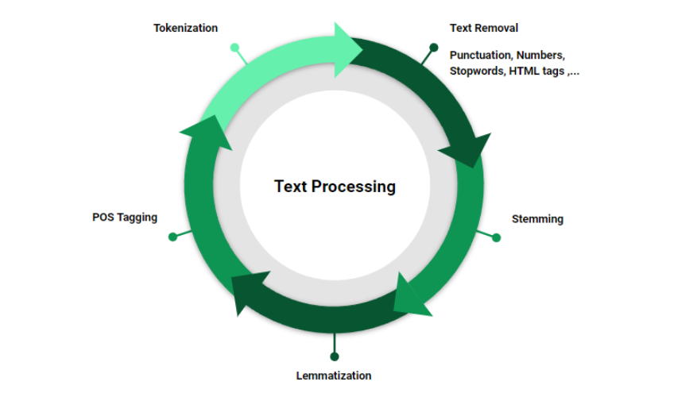
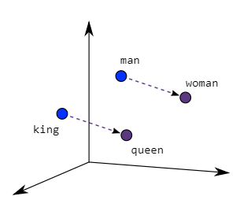

---
sidebar_position: 1
--- 

## 1. Introduction to Natural Language Processing (NLP)


**Natural Language Processing (NLP)** is a subfield of Artificial Intelligence (AI) and computer science that focuses on the interaction between computers and human (natural) languages. The goal of NLP is to enable machines to understand, interpret, generate, and respond to human language in a way that is both meaningful and useful.

In essence, NLP bridges the gap between human communication and computer understanding, allowing machines to read, hear, and make sense of the vast amounts of human language data. This field combines computational linguistics, machine learning, and deep learning to process, analyze, and generate natural language text or speech.


### Key Components of NLP

1. **Syntax**: Syntax refers to the rules that govern the structure of sentences. In NLP, syntactic analysis (or parsing) is used to assess whether a sentence conforms to these grammatical rules. It helps the machine identify the roles of words (such as subjects, verbs, and objects) within a sentence.

2. **Semantics**: Semantics involves understanding the meaning of words and sentences. Semantic analysis allows the machine to grasp context and disambiguate words with multiple meanings. For example, understanding that the word "bank" could refer to a financial institution or the side of a river, depending on the context.

3. **Morphology**: This is the study of the structure and form of words, such as roots, prefixes, and suffixes. Morphological analysis breaks words down into their constituent parts to derive meaning.

4. **Pragmatics**: Pragmatics deals with how language is used in practice and how context influences meaning. It helps machines understand indirect language, idioms, and implications behind statements.

5. **Phonology and Speech**: For spoken language processing, NLP also incorporates phonology, which involves the sounds of speech and how they relate to language.

### Common Tasks in NLP

NLP tasks range from simple text processing to complex understanding and generation of language. Some common tasks include:


1. **Text Classification**: Assigning predefined categories to text data, such as spam detection in emails or sentiment analysis of product reviews.
  
2. **Named Entity Recognition (NER)**: Identifying and classifying named entities in text, such as names of people, organizations, dates, and locations.
  
3. **Machine Translation**: Automatically translating text from one language to another. Popular applications include Google Translate and multilingual support in AI systems.

4. **Part-of-Speech (POS) Tagging**: Labeling words in a sentence as nouns, verbs, adjectives, etc., to understand their grammatical role.

5. **Sentiment Analysis**: Determining the sentiment or emotion conveyed in a piece of text, often used in analyzing social media posts or product reviews.

6. **Question Answering**: Building systems that can understand a query and provide the correct answer based on a body of knowledge. This is the foundation of systems like IBM Watson or OpenAI's GPT models.

7. **Speech Recognition and Generation**: Converting spoken language into text (speech-to-text) and generating spoken language from text (text-to-speech).

8. **Text Summarization**: Automatically generating a shorter version of a long text while retaining the essential meaning.

9. **Coreference Resolution**: Identifying when two or more expressions in a text refer to the same entity (e.g., “John” and “he” in a passage).

10. **Language Modeling**: Predicting the next word in a sentence, essential for tasks like autocomplete and text generation.

### Techniques in NLP

The field of NLP has evolved significantly, driven by advancements in machine learning and deep learning. Some of the most prominent techniques and models used in NLP today include:

1. **Rule-based Methods**: Early NLP systems relied on handcrafted rules to process language. These were limited in scalability and adaptability.

2. **Machine Learning**: Modern NLP uses supervised and unsupervised learning techniques to model language. Algorithms like Naive Bayes, Support Vector Machines (SVM), and decision trees are applied to NLP tasks like classification and clustering.

3. **Deep Learning**: Neural networks, especially **Recurrent Neural Networks (RNNs)** and **Convolutional Neural Networks (CNNs)**, are widely used in NLP to handle tasks that involve sequential data like text. Variants like Long Short-Term Memory (LSTM) networks have been effective in capturing long-range dependencies in text.

4. **Transformers**: The introduction of the **Transformer architecture** revolutionized NLP. Transformers, unlike RNNs, can process words in parallel and better capture the context. Models like **BERT (Bidirectional Encoder Representations from Transformers)**, **GPT (Generative Pre-trained Transformer)**, and **T5 (Text-to-Text Transfer Transformer)** are based on this architecture, achieving state-of-the-art results in many NLP tasks.

5. **Pre-trained Language Models**: The development of large-scale pre-trained language models has transformed the NLP landscape. These models are pre-trained on vast amounts of text data and then fine-tuned on specific tasks. Some notable examples include BERT, GPT-3, and MBart. These models have made NLP accessible for applications like chatbots, translation, and even creative writing.

### Challenges in NLP

Despite the advancements, there are several challenges that remain in NLP:

1. **Ambiguity**: Language is inherently ambiguous. A single word can have multiple meanings, and a sentence's meaning can change based on context, tone, or cultural factors.

2. **Contextual Understanding**: While recent models like Transformers have improved context capture, maintaining long-term context in lengthy conversations or documents is still a challenge.

3. **Multilinguality**: Developing NLP systems that work seamlessly across multiple languages is complex. Languages differ in grammar, syntax, and cultural references, making universal models difficult to create.

4. **Bias in Language Models**: Since many NLP models are trained on large datasets scraped from the internet, they can inadvertently learn and perpetuate biases present in the data. Efforts are being made to make these models more equitable.

5. **Common-Sense Reasoning**: While models can excel at understanding patterns in language, they often struggle with common-sense reasoning. They lack real-world knowledge that humans take for granted.

### Applications of NLP

NLP is applied across various industries and technologies:

- **Search Engines**: NLP is at the core of search algorithms, helping understand and rank relevant results for user queries.
  
- **Virtual Assistants**: Systems like Amazon Alexa, Google Assistant, and Siri use NLP to understand spoken commands and respond appropriately.

- **Customer Service**: Chatbots and virtual assistants in customer support use NLP to handle inquiries and provide solutions automatically.

- **Healthcare**: NLP helps in medical data processing, summarizing patient records, and assisting with clinical decision support systems.

- **Social Media Analysis**: Sentiment analysis and trend detection in social media platforms rely on NLP to interpret user interactions.

- **Legal and Finance**: NLP is used to process legal documents, financial reports, and automate contract analysis.

### Summary

Natural Language Processing is a dynamic and rapidly evolving field that aims to give machines the ability to understand, interpret, and generate human language. From rule-based systems to modern deep learning models like Transformers, NLP has come a long way and is now central to many technologies we interact with daily. However, there are still challenges related to ambiguity, multilinguality, and bias that researchers continue to address as the field advances.

## 2. NLP Pipeline

The NLP pipeline consists of several stages that transform raw text into structured data suitable for analysis or model input. Here's a detailed breakdown:


1. **Data Collection**:

   **What:** Gathering raw text data from various sources.

   **When:** At first to collect the data for training

   **How:** Web scraping, APIs, databases, user-generated content

   **Why:** To obtain the necessary input for analysis and model training.

2. **Data Processing (Cleaning, Tokenization, etc.)**:

   **What:** Preparing the raw text data for analysis.

   **When:** Before building the model to ensure that data is good for model to be trained on

   **How:** Through various text processing methods (detailed in the next section)

   **Why:** To improve data quality and consistency for better results.

3. **Model Building**:

   **What:** Creating and training NLP models on the processed data.

   **When:** Once data is created model should be created along with the training paradigm

   **How:** Using machine learning algorithms, deep learning architectures, or pre-trained models

   **Why:** To develop models capable of understanding and generating natural language.

4. **Inference/Testing**:

   **What:** Using the trained model to make predictions or generate output.

   **When:** Once model is trained, to use the model for getting results on new data

   **How:** Feeding new data into the trained model and interpreting the output

   **Why:** To apply the model to new, unseen data and obtain results.

5. **Deployment**:

   **What:** Making the NLP model available for use in real-world applications.

   **When:** After rigorous testing and inferencing deployed for real world users to use

   **How:** Through APIs, cloud services, or on-premises infrastructure

   **Why:** To integrate the NLP capabilities into products or services.

## 3. Text Processing

Text processing is a crucial step in the NLP pipeline, occurring after data collection and before model building. It's essential for cleaning and preparing raw text data, improving data quality and consistency for better analysis and model performance. 




Here's a detailed breakdown of text processing methods, including regex, in the order they're typically applied:

### Text Processing Methods: What, When, Why, How

#### **1. Text Normalization**


    
   **What:** Converting text to a standard format (e.g., lowercase).
    
   **When:** At the beginning of text processing.
    
   **Why:** To reduce variability and ensure consistency in the text.
    
   **How:** Using string methods or custom functions

```python
text = "ThIs Is A SaMpLe TeXt."
normalized_text = text.upper()
print(normalized_text)  # Output: "this is a sample text."
```
#### **2. Regular Expressions (Regex)**


**What:** Pattern-based text cleaning and extraction.
    
**When:** Early in the text processing pipeline, often right after or combined with normalization.
    
**Why:** To remove or modify specific patterns in text (e.g., URLs, special characters).
    
**How:** Using the `re` module in Python to define and apply patterns.

```python
import re
text = "Check out this link: https://www.example.com"
clean_text = re.sub(r'http\S+', '', text)
print(clean_text)  # Output: "Check out this link: "
```

####  **3. Tokenization**


**What:** Breaking text into smaller units (tokens), usually words or subwords.
    
**When:** After initial cleaning with regex and normalization.
    
**Why:** To prepare text for further analysis and to work with individual units of meaning.
    
**How:** Using specialized libraries like NLTK or spaCy, or custom functions.

```python
from nltk.tokenize import word_tokenize
text = "NLP is fascinating!"
tokens = word_tokenize(text)
print(tokens)  # Output: ['NLP', 'is', 'fascinating', '!']
```

#### **4. Stop Words Removal**


**What:** Eliminating common words that don't carry significant meaning.
    
**When:** After tokenization, when focusing on content words is important.
    
**Why:** To reduce noise in the text and focus on meaningful words.
    
**How:** Using predefined lists of stop words or custom lists.

Some common stop words are provided here:


```python
from nltk.corpus import stopwords
from nltk.tokenize import word_tokenize

stop_words = set(stopwords.words('english'))
text = "This is a sample sentence with stop words."
tokens = word_tokenize(text)
filtered_tokens = [word for word in tokens if word.lower() not in stop_words]
print(filtered_tokens)  # Output: ['This', 'sample', 'sentence', 'stop', 'words', '.']
```

#### **5. Stemming**
**What:** Reducing words to their root form by removing suffixes.
    
**When:** After stop words removal, when quick normalization is needed without preserving exact meaning.
    
**Why:** To simplify text and reduce vocabulary size.
    
**How:** Using rule-based algorithms like Porter or Snowball stemmers.

```python
from nltk.stem import PorterStemmer
stemmer = PorterStemmer()
words = ["running", "runs", "ran"]
stemmed_words = [stemmer.stem(word) for word in words]
print(stemmed_words)  # Output: ['run', 'run', 'ran']
```
#### **6. Lemmatization**

**What:** Reducing words to their base or dictionary form (lemma).
    
**When:** After stop words removal, when you need to normalize words while preserving meaning.
    
**Why:** To reduce word variations and improve text analysis accuracy.
    
**How:** Using morphological analysis and dictionaries, often with part-of-speech information.

Here is a comparison of stemming vs lemmatization


```python

from nltk.stem import WordNetLemmatizer

lemmatizer = WordNetLemmatizer()
words = ["betterness", "running", "ate"]
lemmatized_words = [lemmatizer.lemmatize(word) for word in words]
print(lemmatized_words)  # Output: ['better', 'running', 'eat']

```
### 3.1 Detailed Explanation of Regex in Text Processing

Regular expressions (regex) play a crucial role in text processing, often being used early in the pipeline to clean and standardize text. Here's a more detailed look at regex in text processing:

#### **What:**
Regex is a sequence of characters that define a search pattern. It's a powerful tool for pattern matching and text manipulation.

#### **When:**
- During initial text cleaning, often right after or combined with normalization.
- Throughout the text processing pipeline for specific cleaning tasks.

#### **Why:**
- To efficiently remove or modify specific patterns in text.
- To extract particular pieces of information from text.
- To standardize text format and structure.

#### **How:**
Using the `re` module in Python to define patterns and apply them to text. Common methods include:

1. **re.sub()**: For substituting patterns with replacement text.
2. **re.findall()**: For finding all occurrences of a pattern.
3. **re.search()**: For finding the first occurrence of a pattern.

#### **Common Regex Operations in Text Processing:**


1. **Removing Special Characters**:
   ```python
   import re
   text = "Hello! How are you? I'm doing great. #happy"
   clean_text = re.sub(r'[^a-zA-Z\s]', '', text)
   print(clean_text)  # Output: "Hello How are you Im doing great happy"
   ```

2. **Removing Extra Whitespace**:
   ```python
   import re
   text = "This   has   extra   spaces."
   clean_text = re.sub(r'\s+', ' ', text).strip()
   print(clean_text)  # Output: "This has extra spaces."
   ```

3. **Extracting Emails**:
   ```python
   import re
   text = "Contact us at info@example.com or support@example.com"
   emails = re.findall(r'\b[A-Za-z0-9._%+-]+@[A-Za-z0-9.-]+\.[A-Z|a-z]{2,}\b', text)
   print(emails)  # Output: ['info@example.com', 'support@example.com']
   ```

4. **Removing HTML Tags**:
   ```python
   import re
   html = "<p>This is <b>bold</b> text</p>"
   clean_text = re.sub(r'<[^>]+>', '', html)
   print(clean_text)  # Output: "This is bold text"
   ```

5. **Standardizing Phone Numbers**:
   ```python
   import re
   phone = "Call us at 1234567890 or (123) 456-7890"
   standardized = re.sub(r'\D', '', phone)
   print(standardized)  # Output: "12345678901234567890"
   ```

#### **Integration with Other Text Processing Steps:**

Regex is often used in combination with other text processing methods. For example:


1. **Regex + Tokenization**:
   ```python
   import re
   from nltk.tokenize import word_tokenize
   
   text = "Hello! How are you? I'm doing great. #happy"
   clean_text = re.sub(r'[^a-zA-Z\s]', '', text)
   tokens = word_tokenize(clean_text)
   print(tokens)  # Output: ['Hello', 'How', 'are', 'you', 'Im', 'doing', 'great', 'happy']
   ```

2. **Regex + Stop Words Removal**:
   ```python
   import re
   from nltk.corpus import stopwords
   
   stop_words = set(stopwords.words('english'))
   text = "Hello! How are you? I'm doing great. #happy"
   clean_text = re.sub(r'[^a-zA-Z\s]', '', text)
   words = clean_text.split()
   filtered_words = [word for word in words if word.lower() not in stop_words]
   print(filtered_words)  # Output: ['Hello', 'great', 'happy']
   ```

By integrating regex into the text processing pipeline, you can effectively clean and standardize text before applying more advanced NLP techniques. This helps improve the quality of your data and the performance of subsequent analysis or modeling steps.

## 4. Embedding

Embeddings are dense vector representations of words or phrases that capture semantic meaning. Here are the main embedding methods:

### **Significance of Embeddings**


- Capture semantic relationships between words
- Reduce dimensionality of text data
- Improve performance of many NLP tasks

### **Embedding methods**

#### **1. Bag of Words (BoW)**

**What:** Representing text as a vector of word counts.

**When:** For simple text classification or clustering tasks.

**Why:** Easy to implement and understand.

**How:** Creating a vocabulary and counting word occurrences in each document.


```python 
from sklearn.feature_extraction.text import CountVectorizer
vectorizer = CountVectorizer()
corpus = ["This is the first document.", "This document is the second document."]
X = vectorizer.fit_transform(corpus)
print(X.toarray())
```
#### **2. TF-IDF (Term Frequency-Inverse Document Frequency)**

**What:** Representing the importance of words in a document relative to a collection.

**When:** When you need to consider the relevance of words across documents.

**Why:** Provides a better representation of word importance than simple counts.

**How:** Calculating term frequency and inverse document frequency for each word and applies the following mathematical function


```python 
from sklearn.feature_extraction.text import TfidfVectorizer
vectorizer = TfidfVectorizer()
corpus = ["This is the first document.", "This document is the second document."]
X = vectorizer.fit_transform(corpus)
print(X.toarray())
```
#### **3. Word2Vec**

**What:** Creating dense vector representations of words using neural networks 
 
**When:** When you need to capture semantic relationships between words.
 
**Why:** Produces word embeddings that capture context and semantic meaning.
 
**How:** Trained a shallow neural network on large text corpora based on words near it using methods like CBOW.



```python
from gensim.models import Word2Vec
sentences = [["cat", "say", "meow"], ["dog", "say", "woof"]]
model = Word2Vec(sentences, min_count=1)
vector = model.wv["dog"]
print(vector)
```
#### **4. Custom Embedding Creation with ANN**

**What:** Creating task-specific word embeddings using artificial neural networks.
 
**When:** When pre-trained embeddings don't capture the specific nuances of your domain.
 
**Why:** To create embeddings tailored to your specific task or domain.
 
**How:** Training a neural network with an embedding layer on your specific dataset.


```python
import torch
import torch.nn as nn

class CustomEmbedding(nn.Module):
    def __init__(self, vocab_size, embedding_dim):
        super(CustomEmbedding, self).__init__()
        self.embedding = nn.Embedding(vocab_size, embedding_dim)

    def forward(self, x):
        return self.embedding(x)

vocab_size = 1000
embedding_dim = 50
model = CustomEmbedding(vocab_size, embedding_dim)
input_ids = torch.tensor([1, 2, 3, 4, 5])
embeddings = model(input_ids)
print(embeddings.shape)
```
## 5. NLP with Machine Learning


This section covers the integration of NLP techniques with machine learning models.

1. **Introduction to Machine Learning**:
   - What: A subset of AI that focuses on creating systems that can learn from and make decisions based on data.
   - Why: To develop models that can automatically improve their performance through experience.

2. **Types of ML models**:

   a. **Supervised Learning**:
      - What: Learning from labeled data to predict outcomes for new, unseen data.
      - Examples: Classification (e.g., spam detection), Regression (e.g., price prediction)

   b. **Unsupervised Learning**:
      - What: Finding patterns or structures in unlabeled data.
      - Examples: Clustering (e.g., customer segmentation), Dimensionality Reduction (e.g., PCA)

   c. **Semi-supervised Learning**:
      - What: Learning from a combination of labeled and unlabeled data.
      - When: When you have a small amount of labeled data and a large amount of unlabeled data.

   d. **Reinforcement Learning**:
      - What: Learning through interaction with an environment to maximize a reward signal.
      - Examples: Game playing (e.g., AlphaGo), Robotics


#### **Introduction**

Naive Bayes is a popular algorithm for text classification. It's based on Bayes' Theorem and makes a "naive" assumption that all features (words, in our case) are independent of each other.

#### **Bayes' Theorem**

Bayes' Theorem is expressed as:

```math
P(A|B) = (P(B|A) * P(A)) / P(B)
```

Where:
- P(A|B) is the probability of A given B has occurred
- P(B|A) is the probability of B given A has occurred
- P(A) is the probability of A occurring
- P(B) is the probability of B occurring

#### **Naive Bayes for Text Classification**

Let's break down how Naive Bayes works for text classification with a simple example.

##### **Step 1: Data Preparation**

Imagine we have a small dataset for sentiment analysis:

| Text                | Sentiment |
|---------------------|-----------|
| "great product"     | Positive  |
| "bad quality"       | Negative  |
| "excellent service" | Positive  |
| "terrible experience"| Negative |

##### **Step 2: Vocabulary Building**

We create a vocabulary of unique words:
{great, product, bad, quality, excellent, service, terrible, experience}

##### **Step 3: Calculate Prior Probabilities**

P(Positive) = 2/4 = 0.5
P(Negative) = 2/4 = 0.5

##### **Step 4: Calculate Likelihood Probabilities**

For each word in each class:

```math
P(word|class) = (count of word in class + 1) / (total words in class + vocabulary size)
```

We add 1 to the numerator and vocabulary size to the denominator for smoothing.

**For Positive class:**
- P(great|Positive) = (1 + 1) / (4 + 8) = 2/12 = 0.167
- P(product|Positive) = (1 + 1) / (4 + 8) = 2/12 = 0.167
- P(excellent|Positive) = (1 + 1) / (4 + 8) = 2/12 = 0.167
- P(service|Positive) = (1 + 1) / (4 + 8) = 2/12 = 0.167
- P(bad|Positive) = (0 + 1) / (4 + 8) = 1/12 = 0.083
- P(quality|Positive) = (0 + 1) / (4 + 8) = 1/12 = 0.083
- P(terrible|Positive) = (0 + 1) / (4 + 8) = 1/12 = 0.083
- P(experience|Positive) = (0 + 1) / (4 + 8) = 1/12 = 0.083

**Similarly for Negative class:**
- P(bad|Negative) = (1 + 1) / (4 + 8) = 2/12 = 0.167
- P(quality|Negative) = (1 + 1) / (4 + 8) = 2/12 = 0.167
- P(terrible|Negative) = (1 + 1) / (4 + 8) = 2/12 = 0.167
- P(experience|Negative) = (1 + 1) / (4 + 8) = 2/12 = 0.167
- P(great|Negative) = (0 + 1) / (4 + 8) = 1/12 = 0.083
- P(product|Negative) = (0 + 1) / (4 + 8) = 1/12 = 0.083
- P(excellent|Negative) = (0 + 1) / (4 + 8) = 1/12 = 0.083
- P(service|Negative) = (0 + 1) / (4 + 8) = 1/12 = 0.083

##### Step 5: Classification

Now, let's classify a new text: "good product"

We calculate:
1. P(Positive|"good product")
2. P(Negative|"good product")

And choose the class with the higher probability.

```math

P(Positive|"good product") ∝ P(Positive) * P(good|Positive) * P(product|Positive)
                            = 0.5 * 0.083 * 0.167
                            = 0.00693
```

```math
P(Negative|"good product") ∝ P(Negative) * P(good|Negative) * P(product|Negative)
                            = 0.5 * 0.083 * 0.083
                            = 0.00344
```

Since 0.00693 > 0.00344, we classify "good product" as Positive.

#### Why Naive Bayes Works Well for Text Classification

1. **Efficiency**: It's fast and requires little training data.
2. **Handles high dimensionality**: Works well with the large number of features in text data.
3. **Performs well in practice**: Despite its "naive" assumption, it often gives good results for text classification.

#### Limitations

The main limitation is the assumption of feature independence, which is rarely true in real-world text data. However, the algorithm often performs well despite this assumption.


#### Training a Text Classifier

Now lets see how to train a text classifier with Naive Bayes
